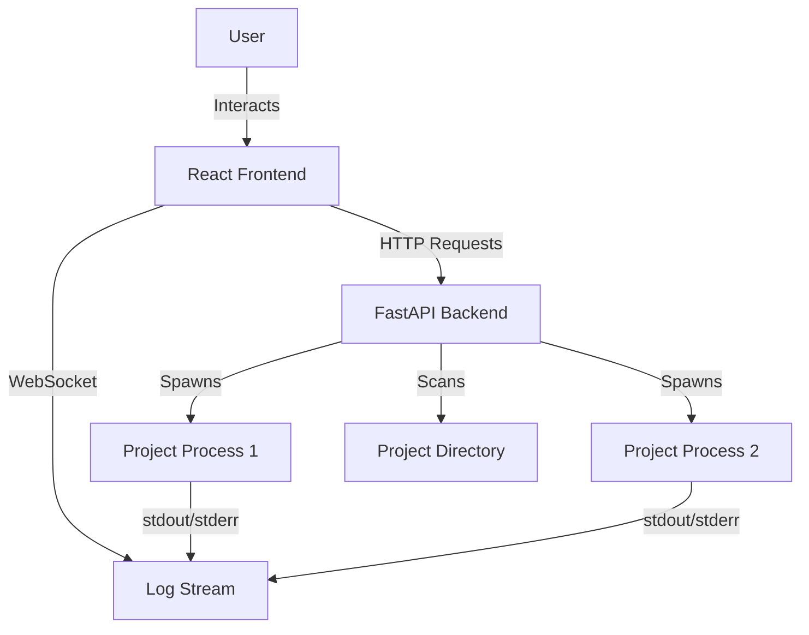

# Project Manager Dashboard

 

A local command center for managing, monitoring, and launching your development projects (Python, React, Vite, Next.js, etc.). It provides a sleek, futuristic UI to visualize your project hub, start/stop applications, and view real-time logs.

## Features

- 🕵️ **Auto-Detection**: Scans a specified folder to detect projects and their types (Python, React, Vite, Next.js, etc.).
- 🚀 **One-Click Start/Stop**: Manage project lifecycles directly from the dashboard.
- 📺 **Live Terminals**: View real-time stdout/stderr logs for each running project via WebSockets.
- 🎨 **Modern UI**: Glassmorphism design with fluid animations and sounds.
- ⚙️ **Port Management**: Customize ports for each application.
- 🔍 **Filtering**: Filter projects by technology or search by name.
- 🐍 **Python VirtualEnv Support**: Automatically detects and uses `venv` if present.

## Architecture

The project consists of a FastAPI backend that manages subprocesses and a React frontend that communicates via HTTP and WebSockets.



## Getting Started

### Prerequisites

- **Python 3.8+**
- **Node.js 16+**
- **npm** or **yarn**

### 1. Backend Setup

The backend is built with FastAPI. It handles project scanning and process management.

1. Navigate to the backend directory:
   ```bash
   cd backend
   ```
2. Create a virtual environment:
   ```bash
   python -m venv venv
   source venv/bin/activate  # On Windows: venv\Scripts\activate
   ```
3. Install dependencies:
   ```bash
   pip install -r requirements.txt
   ```
4. Create a `.env` file in the `backend` folder with your project path:
   ```env
   PROJECT_PATH=C:/Users/your_user/Documents/Projects
   EXCLUDE_APPS=["__pycache__", ".git", "node_modules"]
   ```
5. Start the server:
   ```bash
   uvicorn main:app --reload --port 8000
   ```

### 2. Frontend Setup

The frontend is a React + Vite application.

1. Navigate to the frontend directory:
   ```bash
   cd frontend
   ```
2. Install dependencies:
   ```bash
   npm install
   ```
3. Start the development server:
   ```bash
   npm run dev
   ```
4. Open your browser at `http://localhost:5173`.

## Environment Variables

| Variable | Description | Default |
|----------|-------------|---------|
| `PROJECT_PATH` | The absolute path to the root directory where your projects are located. | None |
| `EXCLUDE_APPS` | A JSON array of folder names to exclude from the scan. | `[]` |

## API Documentation

### Endpoints

| Method | Endpoint | Description |
|--------|----------|-------------|
| `GET` | `/api/projects` | Returns a list of all detected projects and their status. |
| `POST` | `/api/projects/{id}/start` | Starts the project with the specified `id`. Query param `port` is required. |
| `POST` | `/api/projects/{id}/stop` | Stops the project with the specified `id`. |
| `WS` | `/api/ws/{id}` | WebSocket connection for real-time logs of project `id`. |

### Python Projects Disclaimer
<div style="background-color: #333; padding: 10px; border-left: 5px solid #f1c40f; color: white;">
⚠️ <strong>Important for Python Developers:</strong><br>
For Python projects to be correctly detected and launched:
<ul>
  <li>The virtual environment directory must be named <code>venv</code> and located in the project root.</li>
  <li>The entry point must be a file named <code>main.py</code> (or <code>app.py</code>) in the project root.</li>
</ul>
</div>

## License

Distributed under the MIT License. See `LICENSE` for more information.
